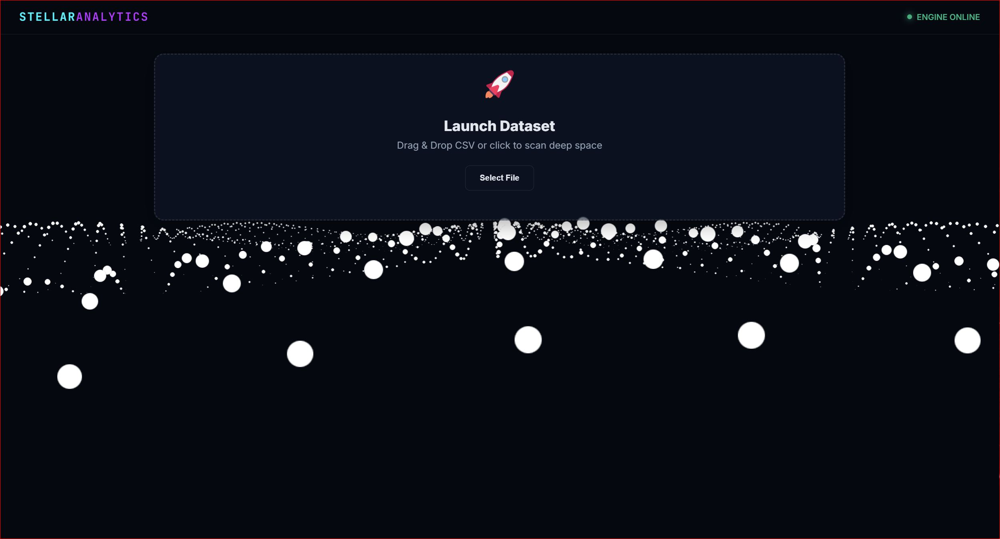
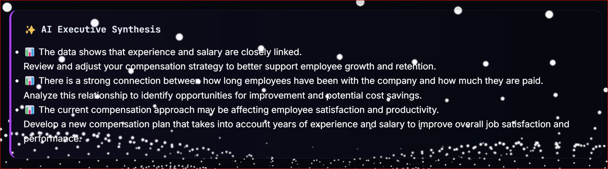
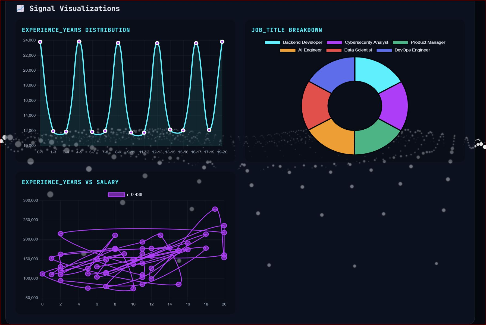
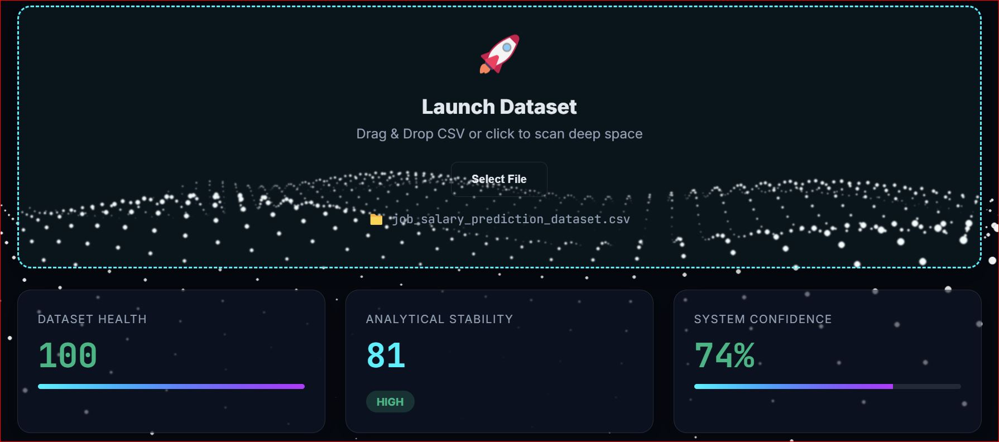

# 🚀 AI Management Consulting System


[](https://ai-management-consulting.netlify.app/)
[](https://legendaryaloha-ai-consulting-api.hf.space/)

> ⚠️ Important: Start the API Backend first, then open the Live Website.

An enterprise-grade analytics platform that transforms raw CSV data into actionable business intelligence. By leveraging a custom 24-layer analytical pipeline and LLM-powered synthesis (Groq / Ollama), the system generates dynamic, interactive dashboards with human-readable strategic directives.


---

## 📖 Overview
Traditional data analysis tools require manual querying, static charts, and hours of interpretation. The AI Management Consulting System automates this entire workflow.

A user uploads a CSV dataset through a futuristic, glassmorphic web interface. The backend orchestrates a rigorous 24-layer pipeline—ranging from statistical correlation analysis and anomaly detection to theme extraction and conflict resolution. The refined signals are then passed to a Large Language Model (Groq's Llama 3.3 70B or local Ollama), which generates a clear, two-level executive summary: what the data means and what action to take.

Results are rendered via animated charts, color-coded diagnostic scores, and clean UI components.

---

## 📸 Screenshots

### Full Dashboard Overview


### AI Executive Synthesis


### Animated Signal Visualizations


### System Diagnostics & Scoring


---

## ✨ Key Features

- **24-Layer Analytics Pipeline:** End-to-end processing covering profiling, Pearson correlations, anomaly detection, stability calibration, cross-theme reasoning, and executive synthesis.
- **LLM-Powered Insights:** Generates jargon free, 2-level actionable insights (Analysis + Suggestion) using Groq (Llama 3.3 70B) or local Ollama (local fallback).
- **Interactive 3D UI:** A dynamic, mouse-reactive particle constellation built with Three.js.
- **Animated Data Visualizations:** Auto-detects data types to generate smooth Area Charts (continuous data), Neon Doughnut Charts (categorical data), and Scatter Plots with trend lines (correlations) via Chart.js.
- **Smart Metric Scoring:** Dynamic health, stability, and confidence scores that change color (Green/Yellow/Red) based on data quality.
- **Seamless UX:** Drag-and-drop CSV upload, smooth auto-scrolling to results, and animated number counters.
- **Structured Logging:** Pipeline execution logs are silently written to `backend/logs/pipeline.log` in structured JSON format, keeping the terminal clean while preserving deep debuggability.

---

## 🏗 System Architecture
```
[ CSV Dataset ]
      │
      ▼
[ FastAPI Backend ] ──> [ 24-Layer Pipeline Engine ]
      │                         │
      │                         ├─ Raw Computation (Profile, Correlations, Health)
      │                         ├─ Normalization (Signal Scaling, Taxonomy)
      │                         ├─ Structuring (Contextual Synthesis, Themes)
      │                         ├─ Reasoning (Stability, Cross-Theme Logic)
      │                         └─ Decision (Executive Synthesis, Confidence)
      │                         │
      │                         ▼
      │                  [ AI Readiness Layer ]
      │                         │
      │                         ▼
      │                  [ Groq / Ollama LLM ]
      │                         │
      ▼                         ▼
[ JSON API Response ] ◄─────────┘
      │
      ▼
[ Frontend Dashboard ] ──> Chart.js / Three.js / DOM Rendering
```
---

## 🛠 Tech Stack

| Layer        | Technology                                                                 |
|---------------|----------------------------------------------------------------------------|
| **Backend**  | Python 3.10+, FastAPI, Pydantic, Pandas, NumPy, SciPy                     |
| **AI/LLM**   | Groq API (Llama 3.3 70B), Ollama (Qwen 2.5 7B - Fallback)                 |
| **Frontend** | Vanilla JavaScript, HTML5, CSS3 (Glassmorphism), Three.js, Chart.js       |
| **Tooling**  | Uvicorn, python-dotenv, Git                                                |

---
## 📂 Project Structure

```text
ai-management-consulting/
│
├── .git/                     # Git version control
├── .gitignore                # Ignored files (env, logs, venv, uploads)
├── README.md                 # Project documentation
│
├── frontend/                 # Client-side application
│   ├── background.js         # Three.js interactive 3D constellation
│   ├── index.html            # Main dashboard UI structure
│   ├── script.js             # API calls, DOM rendering, Chart.js logic
│   └── style.css             # Space theme, glassmorphism, grid layouts
│
├── backend/                  # Server-side application
│   ├── logs/
│   │   └── pipeline.log      # Structured JSON pipeline execution logs
│   │
│   ├── schemas/
│   │   └── analytics_response.py  # Pydantic response models
│   │
│   ├── uploads/              # Uploaded CSV dataset storage
│   ├── venv/                 # Python virtual environment
│   │
│   ├── .env                  # Environment variables (Groq API Key)
│   ├── ai_client.py          # Groq / Ollama LLM integration
│   ├── main.py               # FastAPI app entrypoint & routes
│   ├── mappers.py            # Internal state -> API response mapper
│   └── requirements.txt      # Python dependencies
│
└── analytics_pipeline/       # Core analytics engine
    ├── layers/
    │   ├── __init__.py
    │   ├── decision.py       # Executive synthesis & confidence scoring
    │   ├── normalization.py  # Signal scaling & taxonomy
    │   ├── output.py         # Narrative, insights & recommendations
    │   ├── raw_computation.py # Profiling, charts, correlations, health
    │   ├── reasoning.py      # Analytical stability & cross-theme logic
    │   └── structuring.py    # Contextual synthesis & theme metrics
    │
    ├── tests/                # Pipeline unit tests
    │   ├── __init__.py
    │   ├── conftest.py
    │   ├── test_layers.py
    │   ├── test_orchestrator.py
    │   └── test_serialization.py
    │
    ├── __init__.py
    ├── ai_readiness.py       # LLM context builder
    ├── config.py             # Pipeline settings & weight configurations
    ├── exceptions.py         # Custom pipeline error classes
    ├── logger.py             # Dual-handler JSON logger setup
    ├── orchestrator.py       # Pipeline execution engine & registry
    ├── schema.py             # State validation logic
    └── utils.py              # Shared helper functions
```

---

## 🚀 Getting Started

### 1. Prerequisites
- **Python 3.10+** installed on your system.
- **Groq API Key** (Get one free at [console.groq.com](https://console.groq.com/)) *or* Ollama running locally

### 2. Clone the Repository
```bash
git clone https://github.com/your-username/ai-management-consulting.git
cd ai-management-consulting
```

### 3. Setup Python Environment
It is highly recommended to use a virtual environment:
```bash
# Navigate to the backend directory
cd backend

# Create virtual environment
python -m venv venv

# Activate it (Windows)
venv\Scripts\activate

# Activate it (Mac/Linux)
source venv/bin/activate
```

### 4. Install Dependencies
```bash
pip install -r requirements.txt
```

### 5. Configure Environment Variables
Create a `.env` file in the root directory and add your Groq API key:
```env
GROQ_API_KEY=gsk_your_api_key_here
```
*(If you don't have a Groq key, the system will automatically fall back to Ollama if it's running locally).*

---

## 💻 Running the Application

### Start the Backend Server
From the backend/ directory (with your virtual environment activated) run:
```bash
uvicorn backend.main:app --reload --port 8000
```
*The API will be live at `http://127.0.0.1:8000`*

### Open the Frontend
Simply open `index.html` in your web browser (double-click it, or use a Live Server extension in VS Code).

---

## 📊 How to Use

1. **Upload Dataset:** Drag and drop a .CSV file into the upload zone or click "Select File".
2. **Processing:** Click **"🚀 Launch Analysis"**. The 24-layer pipeline will execute, and the AI will analyze the results.
3. **View Diagnostics:** The page will smoothly scroll down to reveal your System Health, Stability, and Confidence scores (color-coded for quick understanding).
4. **Explore:** The dashboard will smoothly scroll to reveal your System Diagnostics, AI Executive Synthesis, animated Signal Visualizations, and Strategic Directives.
5. **Read AI Insights:** The "AI Executive Synthesis" card provides a clean, 2-level breakdown of what the data means and what to do next.
6. **Explore Charts:** View auto-generated Signal Visualizations (Distributions, Breakdowns, Correlation Scatter Plots).
7. **Take Action:** Reiew the "Strategic Directives" for prioritized, human-readable recommendations.

---

## ⚙️ Logging & Debugging

Terminal output is kept clean to show only lifecycle events (Pipeline Start, AI Completion, Errors). 

All detailed layer-by-layer execution data is logged to:
```text
backend/logs/pipeline.log
```
Logs are formatted as structured JSON for easy parsing and debugging.

---

## 📜 License

This project is licensed under the MIT License. See the [LICENSE](./LICENSE) file for details.